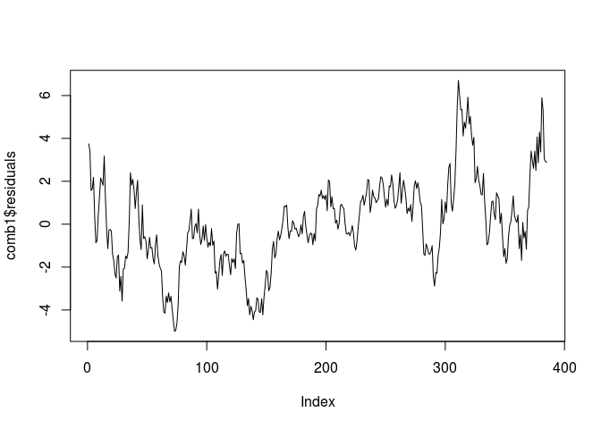
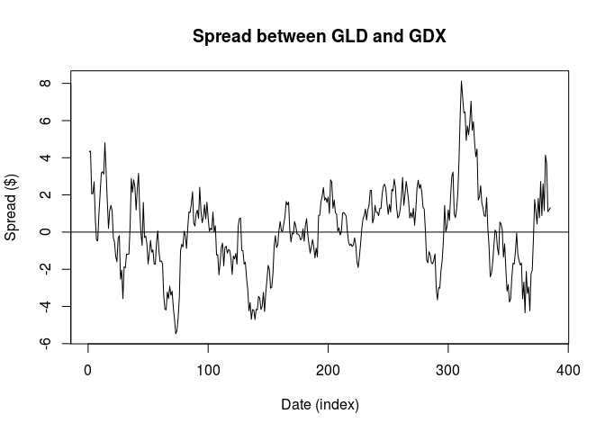

How to Form a Good Cointegrating and Mean-Reverting Pair of Stocks
------------------------------------------------------------------

If you long one security and short another one in the same industry group and in the right proportion, sometimes the combination (or “spread”) becomes a stationary series.

A stationary series is an excellent candidate for a mean-reverting strategy. This example teaches you how to determine if two price series are cointegrated and, if so, how to find the optimal “hedge ratio” (i.e., the number of shares of the second security versus one share of the first security).

The main method used to test for cointegration is called the cointegrating augmented Dickey-Fuller test, hence the function name cadf. A detailed description of this method can be found in the manual also available on the same web site mentioned earlier.

The following program is available online as epchan.com/book/ example7 2.m

This is taken from exercise 7.2 of E.Chans book Quantitative Trading.

``` r
rm(list = ls())
library(tseries)
```

``` r
# read a spreadsheet named "GLD.xls" into MATLAB. 
gld_in <- read.csv(file.path("data", "GLD.csv"))

# the first column (starting from the second row) is the trading days in
# format mm/dd/yyyy.
tday1 <- gld_in$Date

# convert the format into yyyymmdd.
tday1 <- format(as.Date(tday1, "%d/%m/%Y"), "%Y%m%d")

# convert the date strings first into cell arrays and then into numeric format.
tday1 <- as.numeric(as.character(tday1))

# the last column contains the adjusted close prices.
adjcls1 <- gld_in$Adj.Close

# read a spreadsheet named "GDX.xls" into MATLAB. 
gdx_in <- read.csv(file.path("data", "GDX.csv"))

# the first column (starting from the second row) is the trading days in 
# format mm/dd/yyyy.
tday2 <- gdx_in$Date

# convert the format into yyyymmdd.
tday2 <- format(as.Date(tday2, "%d/%m/%Y"), "%Y%m%d")

# convert the date strings first into cell arrays and then into numeric format.
tday2 <- as.numeric(as.character(tday2))

# the last column contains the adjusted close prices.
adjcls2 <- gdx_in$Adj.Close
```

``` r
# find all the days when either GLD or GDX has data.
tday <- sort(union(tday1, tday2))
adjcls <- matrix(NaN, length(tday), 2)
#========================================
# tday1
foo <- dplyr::intersect(tday1, tday)

# idx1 is the indices of tday1
idx1 <- match(foo, tday1)

# idx is the indices of tday
idx <- match(foo, tday)

adjcls[idx, 1] <- adjcls1[idx1]

#========================================
# tday2
foo <- dplyr::intersect(tday2, tday)

# idx1 is the indices of tday2
idx2 <- match(foo, tday2)

# idx is the indices of tday
idx <- match(foo, tday)

adjcls[idx, 2] <- adjcls2[idx2]
```

``` r
#========================================

# days where any one price is missing
baddata <- which(rowSums(is.na(adjcls))>0)

# eliminate days when any return is missing
#ret <- ret[-baddata,]
tday <- tday[-baddata]
adjcls <- adjcls[-baddata,]

vnames <- c('GLD', 'GDX')
```

``` r
# run cointegration check using augmented Dickey-Fuller test
# can't find a direct function to do this so:

# taken from https://www.quantstart.com/articles/Cointegrated-Augmented-Dickey-Fuller-Test-for-Pairs-Trading-Evaluation-in-R

# it is unclear as to which series is the dependent variable and which is the independent variable for the regression. Thus we will try both and make a choice based on the negativity of the ADF test statistic.

comb1 <- lm(adjcls[,1]~adjcls[,2])
comb2 <- lm(adjcls[,2]~adjcls[,1])

# This will provide us with the intercept and regression coefficient for these pairs. We can plot the residuals and visually assess the stationarity of the series:
  
plot(comb1$residuals, type="l")
```



``` r
comb1
```

    ## 
    ## Call:
    ## lm(formula = adjcls[, 1] ~ adjcls[, 2])
    ## 
    ## Coefficients:
    ## (Intercept)  adjcls[, 2]  
    ##      10.154        1.386

``` r
comb2
```

    ## 
    ## Call:
    ## lm(formula = adjcls[, 2] ~ adjcls[, 1])
    ## 
    ## Coefficients:
    ## (Intercept)  adjcls[, 1]  
    ##     -0.2654       0.6132

``` r
tseries::adf.test(comb1$residuals, k=1)
```

    ## Warning in tseries::adf.test(comb1$residuals, k = 1): p-value smaller than
    ## printed p-value

    ## 
    ##  Augmented Dickey-Fuller Test
    ## 
    ## data:  comb1$residuals
    ## Dickey-Fuller = -4.5292, Lag order = 1, p-value = 0.01
    ## alternative hypothesis: stationary

``` r
tseries::adf.test(comb2$residuals, k=1)
```

    ## Warning in tseries::adf.test(comb2$residuals, k = 1): p-value smaller than
    ## printed p-value

    ## 
    ##  Augmented Dickey-Fuller Test
    ## 
    ## data:  comb2$residuals
    ## Dickey-Fuller = -4.3011, Lag order = 1, p-value = 0.01
    ## alternative hypothesis: stationary

``` r
"The ADF test statistic for GDX as the independent variable is smaller (more negative) than that for GDX as the independent variable and hence we will choose this as our linear combination for any future trading implementations."
```

    ## [1] "The ADF test statistic for GDX as the independent variable is smaller (more negative) than that for GDX as the independent variable and hence we will choose this as our linear combination for any future trading implementations."

``` r
results <- lm(I(adjcls[,1])~0+adjcls[, 2])
results
```

    ## 
    ## Call:
    ## lm(formula = I(adjcls[, 1]) ~ 0 + adjcls[, 2])
    ## 
    ## Coefficients:
    ## adjcls[, 2]  
    ##        1.64

``` r
# From E. Chan: A hedgeRatio of 1.6766 was found. i.e. GLD=1.6766*GDX + z, 
# where z can be interpreted as the spread GLD-1.6766*GDX and should be 
# stationary.
# Our result was slightly different: 1.639523
hedgeRatio <- results$coefficients
hedgeRatio
```

    ## adjcls[, 2] 
    ##    1.639523

``` r
# plot the residuals
z <- results$residuals
plot(z, type = 'l', xlab = "Date (index)", ylab = "Spread ($)", 
     main = "Spread between GLD and GDX")
abline(h = 0)
```


