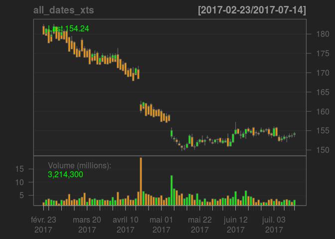

Scrape web pags for financial data
----------------------------------

This is the first in a series of posts that will convert the MATLAB scripts from E Chan's book 'Quantative Trading: How to Build Your Own Algorithmic Trading Business'.

The following code will be used to retrieve a stock's historical price information from Yahoo! Finance

``` r
rm(list = ls()) # clear the workspace
library(httr)
library(quantmod)
```

    ## Loading required package: xts

    ## Loading required package: zoo

    ## 
    ## Attaching package: 'zoo'

    ## The following objects are masked from 'package:base':
    ## 
    ##     as.Date, as.Date.numeric

    ## Loading required package: TTR

    ## Version 0.4-0 included new data defaults. See ?getSymbols.

``` r
library(XML)
library(dplyr)
```

    ## 
    ## Attaching package: 'dplyr'

    ## The following objects are masked from 'package:xts':
    ## 
    ##     first, last

    ## The following objects are masked from 'package:stats':
    ## 
    ##     filter, lag

    ## The following objects are masked from 'package:base':
    ## 
    ##     intersect, setdiff, setequal, union

``` r
symbol <- "IBM" # the stock of interest
in_url <- paste0('http://finance.yahoo.com/q/hp?s=',  symbol)

# retrieving a webpage
histPriceFile_page <-GET(in_url)

# convert to a list
histPriceFile <- readHTMLTable(rawToChar(histPriceFile_page$content), 
                               stringsAsFactors = F)

# extract what we want from the list - the second element
histPriceFile_df <- histPriceFile[[2]]

# view the contents
head(histPriceFile_df)
```

    ##           Date   Open   High    Low Close* Adj Close**    Volume
    ## 1 Jul 14, 2017 154.01 154.62 153.40 154.24      154.24 3,214,300
    ## 2 Jul 13, 2017 153.70 154.19 153.19 153.63      153.63 2,476,100
    ## 3 Jul 12, 2017 153.48 154.24 153.05 153.70      153.70 3,097,900
    ## 4 Jul 11, 2017 153.26 153.65 152.05 153.19      153.19 3,447,500
    ## 5 Jul 10, 2017 152.91 153.89 152.63 153.42      153.42 3,206,200
    ## 6 Jul 07, 2017 152.62 153.49 152.14 152.94      152.94 2,460,100

Now further to the E Chan example we will process this data to: - standardise the colnames without any random characters - convert it to the dplyr::tbl\_df format to ease manipulations - convert the date to the R date format - remove any rows that contain dividends (May 08 2017 in this case) - fill the gaps in the data (e.g. weekends)

``` r
# for ease of later use convert to dplyr::tbl_df
hpf_tbl_df <- tbl_df(histPriceFile_df)
hpf_tbl_df
```

    ## # A tibble: 100 x 7
    ##            Date   Open   High    Low `Close*` `Adj Close**`    Volume
    ##           <chr>  <chr>  <chr>  <chr>    <chr>         <chr>     <chr>
    ##  1 Jul 14, 2017 154.01 154.62 153.40   154.24        154.24 3,214,300
    ##  2 Jul 13, 2017 153.70 154.19 153.19   153.63        153.63 2,476,100
    ##  3 Jul 12, 2017 153.48 154.24 153.05   153.70        153.70 3,097,900
    ##  4 Jul 11, 2017 153.26 153.65 152.05   153.19        153.19 3,447,500
    ##  5 Jul 10, 2017 152.91 153.89 152.63   153.42        153.42 3,206,200
    ##  6 Jul 07, 2017 152.62 153.49 152.14   152.94        152.94 2,460,100
    ##  7 Jul 06, 2017 153.36 153.83 152.23   152.36        152.36 2,757,500
    ##  8 Jul 05, 2017 155.77 155.89 153.63   153.67        153.67 3,564,400
    ##  9 Jul 03, 2017 153.58 156.03 153.52   155.58        155.58 2,822,500
    ## 10 Jun 30, 2017 154.28 154.50 153.14   153.83        153.83 3,571,500
    ## # ... with 90 more rows

``` r
# remove strange characters from the column names
colnames(hpf_tbl_df) <- c("Date", "Open", "High", "Low", "Close", "Adj_Close", "Volume")
```

And that is pretty much it for this example. There are other operations that need to be carried out but I will continue them in other blog posts as I want to keep the echan examples as stand alone items. So for now you can save the data to csv file:

or

``` r
# to remove any rows containing the word Dividend in Open
hpf_tbl_df <- hpf_tbl_df[!grepl("Dividend", 
                                            hpf_tbl_df$Open),]

# currently the data is stored as chars - convert all columns except
# for the date to numeric
hpf_tbl_df$Volume <- gsub(",", "", hpf_tbl_df$Volume)
  
# rejoin all to a new df
hiPriFi_df  <- hpf_tbl_df
hiPriFi_df[, -1] <- apply(hpf_tbl_df[,-1], 2, as.numeric)

# convert the char date to a numeric and straighforward format
num_date <- function(in_date) {
  
  in_month <- strsplit(in_date, " ")[[1]][1]
  out_month <- match(in_month, month.abb)
  
  in_day <- strsplit(in_date, " ")[[1]][2]
  in_year <- strsplit(in_date, " ")[[1]][3]

  out_date <- paste(in_day, out_month, in_year, sep = "/")
  return(out_date)
}

# remove the comma from the Date column
hiPriFi_df$Date <-gsub(",", "", hpf_tbl_df$Date)

# apply the function over all the dates
dates <- unlist(sapply(hiPriFi_df$Date, num_date, 
                simplify = FALSE,
                USE.NAMES = FALSE))

# update the dataframe and convert to a date
hiPriFi_df$Date <- dates
hiPriFi_df$Date <- as.Date(hiPriFi_df$Date, format = "%d/%m/%Y")


# get the max and min date from the dataframe
max_date <- max(hiPriFi_df$Date)
min_date <- min(hiPriFi_df$Date) 

# create a sequence of dates from min to max
all_dates <- data.frame(Date=seq(min_date, max_date, by="days"))

# combine the two dataframes so that all dates are included
# the missing dates now hav NA values
all_dates_df <- merge(hiPriFi_df, all_dates, 
                      by.x='Date',by.y='Date',all.x=T,all.y=T)
```

``` r
# to forward and backfill the weekend gaps

# various methods have been suggested and the library imputeTS has various
# functions: na.interpolation, na.locf and na.kalman; each with different 
# settings. 

# I have been advised that last value forwards and backwards (50% each way)
# is the best method to use for machine learning methods with financial time # series though I would like to test the various possibilities
```

Now let us plot the data to have a look at it
=============================================

``` r
all_dates_xts <- xts(all_dates_df[,-1], order.by = all_dates_df[,1])

candleChart(all_dates_xts)
```


