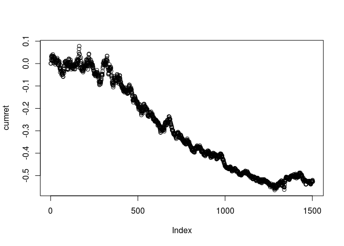

Example 3.4: Calculating Sharpe Ratio for Long-Only Versus
----------------------------------------------------------

Let’s calculate the Sharpe ratio of a trivial long-only strategy for IGE: buying and holding a share since the close of November 26, 2001, and selling it at close of November 14, 2007. Assume the average risk-free rate during this period is 4 percent per annum in this example. You can download the daily prices from Yahoo! Finance, specifying the date range desired, and store them as an Excel file (not the default comma-separated file), which you can call IGE.xls. The next steps can be done in either Excel or MATLAB:

``` r
# make sure previously defined variables are erased.
rm(list = ls())
library(readxl) # to read in the xlsx file
```

``` r
# read a spreadsheet named "IGE.xls" into MATLAB.
# remove this directory before publishing ***
dir <- "/home/deckard/Dropbox/Ebooks/finance/beginners/epchan_quantTrading/data"
ige_dat <- read_xlsx(file.path(dir, "IGE.xlsx"))
head(ige_dat)                      
```

    ## # A tibble: 6 x 7
    ##   Date                 Open  High   Low Close Volume `Adj Close`
    ##   <dttm>              <dbl> <dbl> <dbl> <dbl>  <dbl>       <dbl>
    ## 1 2007-11-14 00:00:00   129   130   127   128  35900         128
    ## 2 2007-11-13 00:00:00   125   127   124   127  73300         127
    ## 3 2007-11-12 00:00:00   132   132   125   125  98600         125
    ## 4 2007-11-09 00:00:00   133   133   130   131  54000         131
    ## 5 2007-11-08 00:00:00   133   135   131   133 105600         133
    ## 6 2007-11-07 00:00:00   136   137   132   132  92200         132

``` r
# the first column 
# contains the trading days in format yyyy-mm-dd.
tday <- ige_dat$Date

# convert the format into yyyymmdd.
tday <- format(as.Date(tday, "#Y-#m-#d"), "#Y#m#d")
head(tday)
```

    ## [1] "#Y#m#d" "#Y#m#d" "#Y#m#d" "#Y#m#d" "#Y#m#d" "#Y#m#d"

``` r
# convert the date strings first into cell arrays and
# then into numeric format.
tday <- as.numeric(as.character(tday))
```

    ## Warning: NAs introduced by coercion

``` r
head(tday)
```

    ## [1] NA NA NA NA NA NA

``` r
# the last column contains the adjusted close prices.
cls <- ige_dat$`Adj Close`
head(cls)
```

    ## [1] 127.64 127.30 124.88 131.02 133.36 132.50

``` r
data <- data.frame(tday = tday,
                   cls = cls)
head(data)
```

    ##   tday    cls
    ## 1   NA 127.64
    ## 2   NA 127.30
    ## 3   NA 124.88
    ## 4   NA 131.02
    ## 5   NA 133.36
    ## 6   NA 132.50

``` r
# sort tday into ascending order and cls along with it
data <- data[order(tday),]
head(data)
```

    ##   tday    cls
    ## 1   NA 127.64
    ## 2   NA 127.30
    ## 3   NA 124.88
    ## 4   NA 131.02
    ## 5   NA 133.36
    ## 6   NA 132.50

``` r
end <- length(data$cls)
end
```

    ## [1] 1504

``` r
# 1504

# daily returns
dailyret <- (data$cls[2:end]-data$cls[1:end-1])/data$cls[1:end-1]

# excess daily returns assuming risk-free rate of 4#
# per annum and 252 trading days in a year
excessRet <- dailyret - 0.04/252

# the output should be 0.7893
sharpeRatio <- sqrt(252)*mean(excessRet)/sd(excessRet)
sharpeRatio
```

    ## [1] -0.9451842

``` r
# 0.7893175
```

``` r
# Assume this is a continuation of the above code.
# Insert your own code here to retrieve data from
# SPY.xls just as above.
# remove this directory before publishing ***
dir <- "/home/deckard/Dropbox/Ebooks/finance/beginners/epchan_quantTrading/data"
spy_dat <- read_xls(file.path(dir, "SPY.xls"))
head(spy_dat)      
```

    ## # A tibble: 6 x 7
    ##   Date                 Open  High   Low Close   Volume `Adj Close`
    ##   <dttm>              <dbl> <dbl> <dbl> <dbl>    <dbl>       <dbl>
    ## 1 2001-11-26 00:00:00   116   116   115   116 13726000         106
    ## 2 2001-11-27 00:00:00   116   117   114   115 19261400         105
    ## 3 2001-11-28 00:00:00   115   115   113   113 20195500         103
    ## 4 2001-11-29 00:00:00   114   115   113   115 16354700         105
    ## 5 2001-11-30 00:00:00   114   115   114   114 13680300         104
    ## 6 2001-12-03 00:00:00   114   114   113   113 15220400         103

``` r
# the first column 
# contains the trading days in format yyyy-mm-dd.
tdaySPY <- spy_dat$Date

# convert the format into yyyymmdd.
tdaySPY <- format(as.Date(tdaySPY, "#Y-#m-#d"), "#Y#m#d")
head(tdaySPY)
```

    ## [1] "#Y#m#d" "#Y#m#d" "#Y#m#d" "#Y#m#d" "#Y#m#d" "#Y#m#d"

``` r
# convert the date strings first into cell arrays and
# then into numeric format.
tdaySPY <- as.numeric(as.character(tdaySPY))
```

    ## Warning: NAs introduced by coercion

``` r
head(tdaySPY)
```

    ## [1] NA NA NA NA NA NA

``` r
# the last column contains the adjusted close prices.
clsSPY <- spy_dat$`Adj Close`
head(clsSPY)
```

    ## [1] 105.52 105.06 103.16 104.55 103.81 103.19

``` r
dataSPY <- data.frame(tday = tdaySPY,
                   cls = clsSPY)
head(dataSPY)
```

    ##   tday    cls
    ## 1   NA 105.52
    ## 2   NA 105.06
    ## 3   NA 103.16
    ## 4   NA 104.55
    ## 5   NA 103.81
    ## 6   NA 103.19

``` r
# sort tday into ascending order and cls along with it
dataSPY <- dataSPY[order(tdaySPY),]
head(dataSPY)
```

    ##   tday    cls
    ## 1   NA 105.52
    ## 2   NA 105.06
    ## 3   NA 103.16
    ## 4   NA 104.55
    ## 5   NA 103.81
    ## 6   NA 103.19

``` r
end <- length(dataSPY$cls)
end
```

    ## [1] 1504

``` r
# 1504

# daily returns
dailyretSPY <- (dataSPY$cls[2:end]-dataSPY$cls[1:end-1])/dataSPY$cls[1:end-1]

# excess daily returns assuming risk-free rate of 4#
# per annum and 252 trading days in a year
excessRetSPY <- dailyretSPY - 0.04/252

# net daily returns
# (divide by 2 because we now have twice as much capital.)
netRet <- (dailyret - dailyretSPY)/2

# the output should be 0.783681
sharpeRatioSPY <- sqrt(252)*mean(excessRetSPY)/sd(excessRetSPY)
sharpeRatioSPY
```

    ## [1] 0.1820709

``` r
# 0.1820709
```

``` r
# Assume this is a continuation of the above MATLAB
# code.

# cumulative compounded returns
cumret <- cumprod(1+netRet)-1
plot(cumret)
```



``` r
# [maxDrawdown maxDrawdownDuration]=...
# calculateMaxDD(cumret);
# [maxDrawdown maxDrawdownDuration]=...
# calculateMaxDD(cumret);
# # maximum drawdown. Output should be 0.1053
# maxDrawdown
# # maximum drawdown duration. Output should be 497.
# maxDrawdownDuration

# Notice the code fragment above calls a function “calculateMaxDrawdown,”
# which I display below
```
